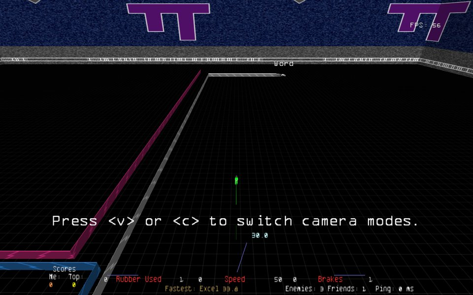
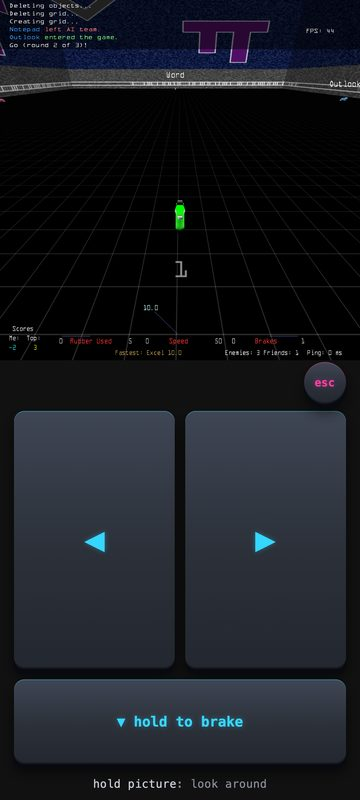
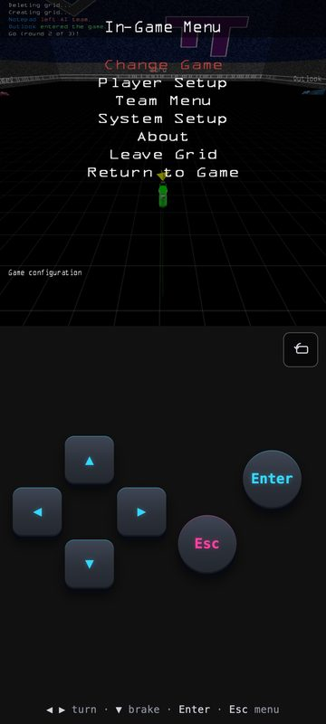
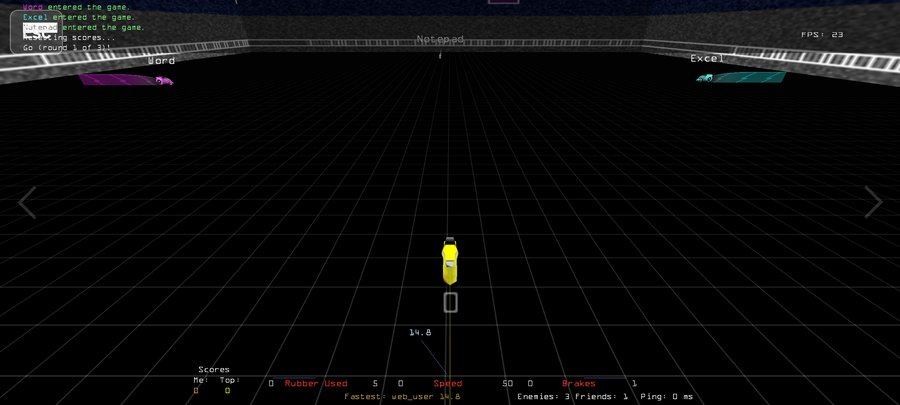

# Armagetron Advanced → in the browser

This is a fork of [Armagetron Advanced](https://www.armagetronad.org/), the
classic 3D lightcycle game, with one goal: **run the real game in a web
browser**, on desktop and on phones, and play on the existing community
servers.

It is not a rewrite or a look-alike. The original C++ engine, physics, AI and
network protocol are compiled to WebAssembly with
[Emscripten](https://emscripten.org/).

## ▶ Play it

**<https://escapedcat.github.io/armagetronad-web/>**


Scan the code to open it on a phone. It needs no install and no account.

- **First visit:** about **1.7 MiB**. After that the game is cached, and your
  settings and key bindings are kept in the browser.
- **Starting:** the game starts on load; there is no Play button.
- **Desktop and Android:** tested in Chrome and Firefox on desktop, and in
  Chrome and Brave on Android.
- **iPhone / Safari:** untested.

<table>
<tr>
<td align="center"><br><sub>Desktop</sub></td>
<td align="center" rowspan="2"><br><sub>Phone, portrait: driving</sub></td>
<td align="center" rowspan="2"><br><sub>Phone, portrait: menus</sub></td>
</tr>
<tr>
<td align="center"><br><sub>Phone, landscape</sub></td>
</tr>
</table>

### Controls

**Desktop:**

| key | action |
|---|---|
| ← → | turn |
| ↓ | brake |
| Escape | in-game menu |
| `n` | fullscreen |

The upstream default also binds `b` to **Toggle Spectator**. If you press it by
accident you only watch from then on, until you set *Player Setup → Spectator
Mode* back to Off.

**Phone:**
- **Portrait:** the game sits in a square at the top, with controls below.
  - **In menus**, a Game Boy pad: a cross, Enter and Esc.
  - **While driving**, two big halves: left thumb turns left, right thumb
    turns right, and sliding from one half into the other switches the turn.
    The bar along the bottom brakes while held. The small Esc opens the menu
    only on a long press, so a stray thumb can't pause the round.
  - **Hold the game picture to look around** while driving: the left or right
    half looks that way, the bottom quarter looks back, and letting go looks
    ahead. The line under the pad says so.
- **Landscape:** tap the left or right half of the screen to turn. In menus a
  tap is Enter, and there are small Up, Down and Escape buttons.
- **The layout is chosen when the game starts.** The rotate button in the
  menus switches it with a short reload.
- **Typing:** the phone keyboard opens by itself when a text field is
  highlighted, such as the name in *Player Setup*, and closes when you move
  off it. Its Enter confirms. If you fold the keyboard away, tap the game to
  bring it back. New players start as `web_` plus four digits. On a server a
  new name takes effect at the next round, as on desktop.
- **Chat:** on a server, once you've crashed, between rounds or while
  watching, the pad's Enter says **Chat**: tap it and the game's chat line
  opens with the keyboard. The keyboard's Enter sends; an empty line just
  closes. While your cycle is alive the pad's Enter does nothing, so a stray
  tap can't turn your arrows into typing. A tap on the picture never opens
  chat. Putting the keyboard away, by folding it or with a tap on the
  picture, closes the chat line without sending. Pasting works from
  the keyboard's clipboard (on Android, the clipboard chip above the keys).
- **Single player** against the AI, on desktop and on phones, with sound.
- **Online multiplayer on the real community servers.** Play → Multiplayer →
  Online Multiplayer lists the live servers, and you join like any desktop
  player.
- **Maps you don't have yet download automatically** when you join a server
  that uses them, and are cached. A few popular server maps come with the page.
- **Settings persist** across visits: keys, player name, display and sound.

## How online play works

A browser cannot send the UDP packets the game speaks. So the page talks
WebSocket to a small **relay** (`bridge/`, on [Fly.io](https://fly.io/)), and
the relay exchanges the UDP datagrams with the game servers. The servers are
unmodified and don't know a browser is involved.

- **No sign-up.** The relay accepts visitors of the published page. It limits
  each player's connections, traffic and requests, and refuses private
  addresses, so it can't be used against anything else.
  See [bridge/README.md](bridge/README.md).
- **Maps go through the same relay.** Its `/resource` route fetches them from
  the official map repository, `resource.armagetronad.net`.
- **All web players share one address.** Servers see every browser player as
  the relay's single IP. A server that autobans an address for too many kicks
  (for example idle kicks) therefore locks out *every* web player for a while.
  This has happened on a busy server.
  - **After 60 s with the tab hidden, the page leaves the server.** It does
    this with a regular logout, which isn't a kick: a background tab or a
    phone that switched apps would otherwise be idle-kicked.
  - **A player who keeps the tab visible but sits idle** can still be kicked,
    so don't park on a server.

## Known limitations

- **Things a browser can't do:**
  - LAN games and hosting a server. LAN Multiplayer is hidden; "Host Game"
    explains why it can't work.
  - Leaving the game: closing the tab is how you quit, so the main menu has no
    Exit Game.
- **Typing on a phone:** a word suggestion that rewrites a word at a text
  field's length limit (15 characters for names) can delete one character too
  many.
- **Phone performance:**
  - The frame rate drops the longer a round goes on. It's CPU-bound, and the
    general fix is still open.
  - Phones get lighter-weight crash sparks by default. `?sparks=1` restores
    the stock sparks, and `?sparks=0` turns them off.
- **Desktop:** `f` doesn't toggle fullscreen, though it's bound; use `n`.
- **Maps from other repositories:** a server's own map repository is used only
  if its host is on the relay's allowlist. Otherwise the client falls back to
  the official repository.

## Why this approach

Armagetron's precise feel lives in about 114k lines of battle-tested C++:
cycle physics, rubber, the collision grid, and server-authoritative netcode
with client prediction. Earlier browser attempts were rewrites that had to
re-create that feel by hand, such as
[Armawebtron](https://github.com/Armawebtron/Armawebtron), a JS/Three.js
rewrite. Compiling the actual engine avoids that problem. The reasoning is in
[ADR 0000](docs/adr/0000-port-real-codebase-via-emscripten.md).

## Build and run it

The full sequence (toolchain, dependencies, build, run) is the
**[Quickstart in `web/README.md`](web/README.md#quickstart)**. It takes about
15 minutes from a fresh clone, mostly spent downloading the Emscripten SDK.

```sh
source deps/emsdk/emsdk_env.sh

# The browser client. It MUST be served over HTTP: a file:// open cannot fetch
# the .wasm and .data, and the page says so instead of starting.
make -f web/Makefile client -j8
python3 -m http.server 8000 --directory web/dist-m1
# open http://localhost:8000/armagetronad.html

# Online play from a local build: run the relay and point the page at it.
(cd bridge && npm install && node relay.mjs --port 8010)
# open http://localhost:8000/armagetronad.html?bridge=ws://127.0.0.1:8010

# The dedicated server, compiled to wasm and run under Node.
make -f web/Makefile dedicated -j8
node web/dist-m0/armagetronad-dedicated.js \
    --datadir . --userdatadir /tmp/aa-persist --daemon < /dev/null
```

The page connects to the public relay by default only on the published page.
Locally it stays offline unless you pass `?bridge=`.

**Tests and gates:**
- **Relay tests:** `cd bridge && npm test`.
- **Browser gates:** the `.steps` scripts in `web/tools/`, driven by
  `web/tools/drive-browser.mjs` in headless Chrome. The `run-*-gate.sh` scripts
  run the complete ones. Each one's header says what it proves and how to run
  it.

**Deploys:**
- **Pages:** every merge to `main` builds the client and publishes it.
- **Relay:** changes under `bridge/` redeploy the relay to Fly
  (`.github/workflows/`).
- **Dedicated server:** CI rebuilds its wasm on every pull request and checks
  that it is byte-identical to the pin, because every port change must leave
  the native and dedicated builds untouched.

## Repo layout

- **Based on upstream's `legacy_0.2.9` branch**, the current stable line. The
  `upstream` remote points to the
  [official GitLab repository](https://gitlab.com/armagetronad/armagetronad),
  so upstream fixes merge cleanly.
- **Port code is additive:** new files under `src/emscripten/`, `web/` and
  `bridge/`, with preprocessor guards elsewhere.
  - The guard for browser-only code is
    `#if defined(__EMSCRIPTEN__) && !defined(DEDICATED)`, because the wasm
    dedicated server defines `__EMSCRIPTEN__` too.
    [docs/porting/browser-runtime-notes.md](docs/porting/browser-runtime-notes.md)
    § 1 explains which form applies where.
- **Where the history lives:**
  - [PLAN.md](PLAN.md): the plan and milestone history.
  - [CONTEXT.md](CONTEXT.md): shared vocabulary.
  - [docs/adr/](docs/adr/): founding decisions.
  - [docs/evidence/](docs/evidence/): what each milestone measured, how, and
    how to re-run it.
  - [docs/superpowers/](docs/superpowers/): specs and implementation plans.
- **The original project's documentation** is in the plain-text
  [README](README) and `README-DEVELOPER`.

## License

GPL-2.0-or-later, same as upstream — see [COPYING.txt](COPYING.txt).
