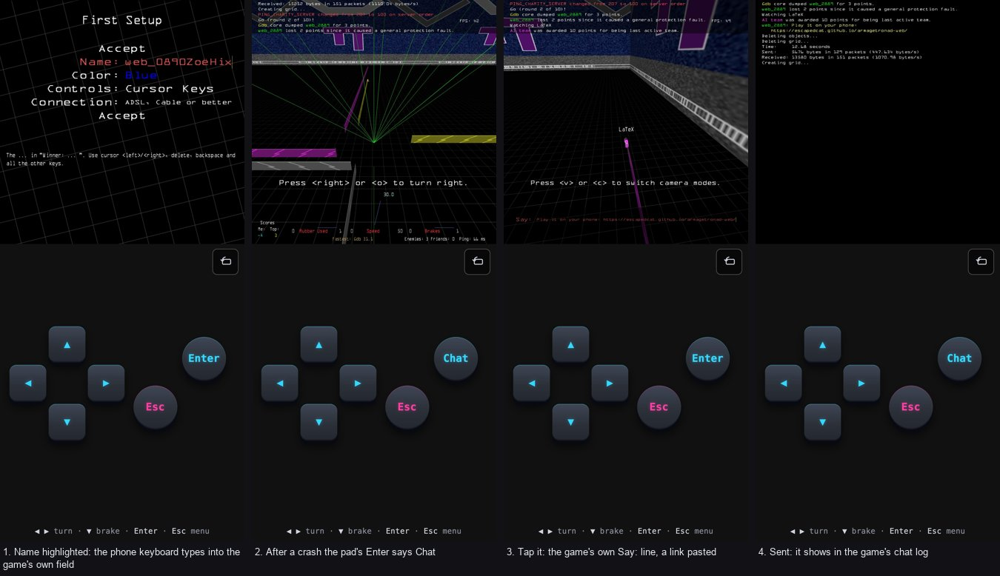

# Phone keyboard: evidence

The phone keyboard types into the game's own text fields
([plan](../../superpowers/plans/2026-09-30-game-text-keyboard.md)). This is
what it was checked against, how, and how to re-run it.

## In the menus: `web/tools/game-keyboard-gate.steps`

An emulated phone (portrait, 412×915, touch) on First Setup:

```sh
python3 -m http.server 8008 --directory web/dist-m1 &
node web/tools/drive-browser.mjs --out /tmp/kbd --mobile 412,915,3 \
  --url http://localhost:8008/armagetronad.html \
  --script-file web/tools/game-keyboard-gate.steps
grep -c '\[KBDGATE\] .*"PASS":true' /tmp/kbd/console.log    # 7
```

- **K1:** no keyboard while Accept is highlighted.
- **K2:** ▼ onto Name opens it.
- **K3:** "Zoë" typed into it lands in the game's own field, and in `user.cfg`.
- **K4:** a suggestion that rewrites "h" → "hi" → "Hi" ends up exact.
- **K5:** a real key typed into the field arrives exactly once.
- **K6:** the keyboard's Enter closes it.
- **K7:** ▲ off the field closes it.

All 7 pass.

## Against a real server: `net/`

The same phone joins the local `aa-dedicated` container through a local relay
and plays a round:

- **While its cycle is alive,** the pad's Enter says "Enter" and does nothing.
  Since M7.1 the pad suppresses Enter while driving, because Enter is the chat
  key.
- **After the crash** it says **Chat**.
- **A real touch tap on it** opens the game's own chat line and the keyboard's
  hidden field.
- **A link is pasted** into the field, and the keyboard's Enter sends it.

```sh
sh web/tools/run-text-net-gate.sh docs/evidence/mobile-keyboard/net
```

The server's own line (`net/server.log`):

```
[L] CHAT web_NNNN Play it on your phone: https://escapedcat.github.io/armagetronad-web/
```

All 9 checks pass (`net/verdict.txt`), on two runs in a row.

**Two things made earlier runs flaky.** Both were fixed in the steps:
- **The first boot pressed Enter before the language menu was up.** The steps
  now wait 9 s, as `leave-hidden-gate` does.
- **The reload raced the save.** The game clears `FIRST_USE` only after First
  Setup closes, so the save as it closes still says 1. The steps now save once
  more before reloading. Without that, the second boot was a first run again
  and the menu keys went into the tutorial round.

## Screenshots: `screens/`



## Default name: `web/tools/default-name-gate.steps`

A fresh profile starts as `web_NNNN`, not `web_user`. D1 passes.

## What emulation can't show

Headless Chrome opens no on-screen keyboard. Focus on the hidden field stands
in for it. Before this was built, the maintainer tried a throwaway version on
an Android phone: the keyboard opens on Name, typing appears in the game's
field, and folding the keyboard away keeps it closed.

## Known edge

The game's text fields refuse characters past their length limit without
telling the page. A suggestion that rewrites a word which ran into the limit
can then delete one character too many.
