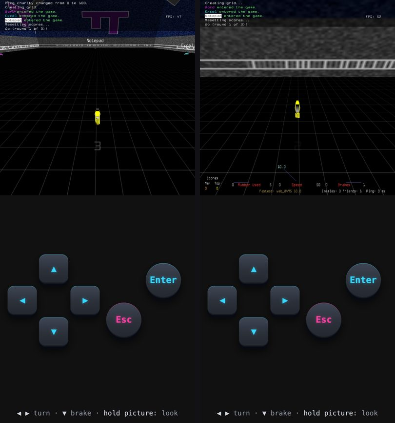

# Looking around on a phone: evidence

While driving in portrait, holding the game picture looks around: the left or
right half looks that way, the bottom quarter looks back, and letting go looks
ahead. The pad's legend says `hold picture: look`
([plan](../../superpowers/plans/2026-10-01-phone-glance.md)).

## The gate: `web/tools/look-gate.steps`

An emulated phone in the first-run tutorial round. Fingers are PointerEvents
on `#lookzone`. The witness is the hook's own line, logged when the game's
camera took the action, e.g. `[LOOK] left on (handled 1)`.

- **L1:** no look zone in menus.
- **L2:** while driving, the look zone is there, and the legend says
  `hold picture: look` and fits the screen.
- **Left:** held, then released.
- **Back:** the bottom quarter held, then released.
- **Right:** held into a crash, and the crash releases it (the finger never
  lifts).

8/8 at 412×915 and at 360×780. Log of the 360 run: `console-360.log`.

## It really turns the view

On the left, looking ahead shows the opponents in front. On the right, the
bottom strip is held, and the camera faces the wall behind.

## Regression

- portrait gate 10/0;
- desktop menu gate 10 distinct screenshots;
- keyboard gate 7/7;
- the dedicated wasm is still 2488298 bytes / `9718a2a64978cb6e9b95ea2f0454cca5`.
