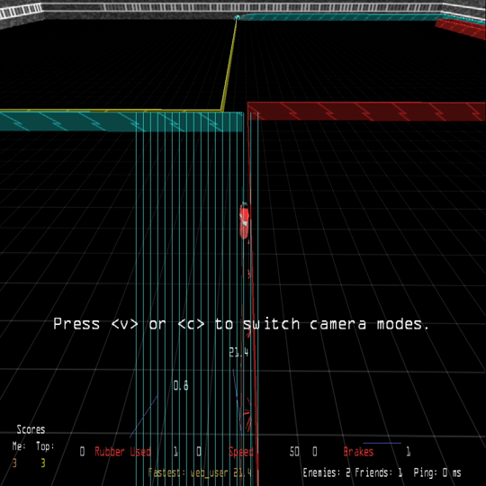

# The phone "wall comb" — found, and cut away

**Status, 2026-09-29:** fixed on touch devices by cutting wall geometry before it reaches the GPU (`src/emscripten/eWebWallCut.cpp`). Strong evidence, not proof — see *How sure* below.

## The symptom

On the maintainer's Android phone (Brave, Game Boy layout), single frames show a **comb of thin lines in a wall's colour** shooting from that wall to the edge of the screen. It lasts one or two frames, 17–33 ms. A Mac never shows it.



`comb-1.png` … `comb-5.png` are the five comb frames captured on video, one per event.

## What causes it

A 3D renderer puts a wall on screen by projecting each corner and **dividing by its distance in front of the camera** — that division is what makes far things small. A corner almost exactly level with the camera, at nearly zero distance, divides out to an enormous screen position. GPUs guard against that by *clipping*: before dividing, they cut away everything closer than a small distance in front of the camera. Desktop GPUs do this carefully. This phone's GPU evidently lets a corner at nearly zero distance through now and then, and it is flung to the edge of the screen, dragging the wall's diagonal texture into vertical stripes.

**Why it's the player's own trail, just after a turn.** The camera rides behind the bike, directly above the trail being laid. A turn puts a corner in the trail, and as the camera swings round to follow, it passes over that corner — for one frame, a corner sits almost level with the camera.

## The five captured events

| recording | time | comb colour | the wall of that colour |
|---|---|---|---|
| 1 (build #43 live) | 22.67 s | cyan | a cyan wall running off the bottom-left, past the camera |
| 5 (plain) | 9.61 s | yellow | the player's own trail, edge-on under the camera |
| 5 (plain) | 31.16 s | yellow | own trail, driving straight, just after a turn |
| 5 (plain) | 40.64 s | yellow | the dead player's walls as the camera cut to "Watching Word" |
| 6 (plain) | 62.27 s | yellow | own trail, just after a turn |

In every one, a wall of the comb's colour ran from in front of the camera to behind it.

## The A/B

Recorded on the phone over the local network, the same build with and without `WALL_CUT`, combs counted with `web/tools/find-comb-frames.py`:

| build | recorded | combs |
|---|---|---|
| plain | 44 s + 68 s | **4 events** |
| `?wallcut=1` | 110 s | **0** |

## How sure

If the cut changed nothing, seeing none where the plain rate predicts about four has roughly a 2 % chance. Against that: two *other* plain recordings (93 s and 153 s, playing differently) showed none at all, so the rate depends strongly on play — mostly on turning — and the arithmetic is weaker than it looks. What makes it convincing is that three independent things agree: one mechanism fits all five events; the fix targets exactly that mechanism; and the A/B came out the way it predicts.

The fix is low-risk regardless: it removes only geometry closer than 0.05 units in front of the camera, which the GPU's near plane throws away anyway. About a third of wall pieces lie wholly behind the camera and are no longer sent at all.

## What it was not — five theories, all disproved on the phone

| theory | tried | result |
|---|---|---|
| depth precision (near plane down to 0.0001) | #40, tunable floor | no change; reverted |
| Chrome's compositing path | #42, a repainting 1 px element | no change; reverted |
| half-drawn frames reaching the screen | #43, draw into a hidden framebuffer | no change, and it squeezed the picture; reverted |
| the growing wall end (`RenderBegin`) going below the floor | a tripwire on every vertex, desktop slowed 6× | never fired |
| wall batches left open (M2's "fragile" note) | close every batch | no change |

**The lesson that cost the most:** an early bisect judged a one-frame flash by eye and concluded the `?diag=1` readout box cured it. Four minutes of plain recordings with no combs later showed that "cure" was chance. Every result on this page is counted from video, not watched.

## Re-checking

Record the phone's screen (Android: *Screen record* in quick settings), then:

```
python3 web/tools/find-comb-frames.py recording.mp4
```

It prints each comb frame with its anisotropy score. Before trusting it on a different phone or layout, confirm it finds a known comb — the calibration is in the tool's header.

`?wallcut=0` switches the cut off on a phone; `?wallcut=1` switches it on anywhere.
